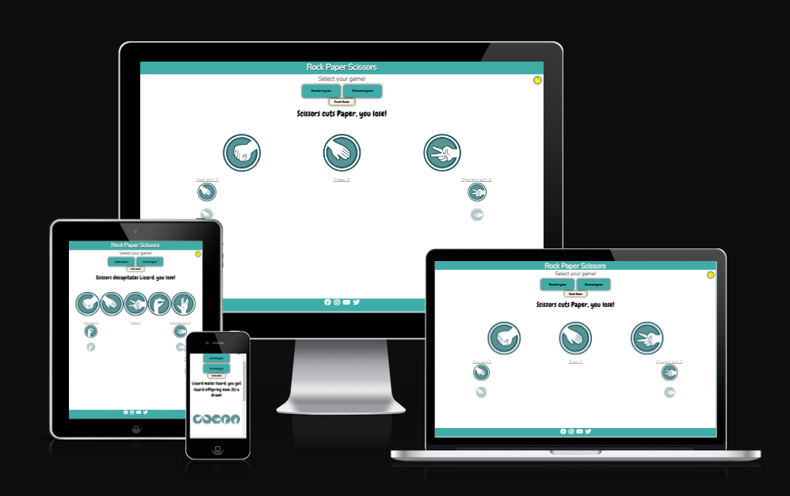
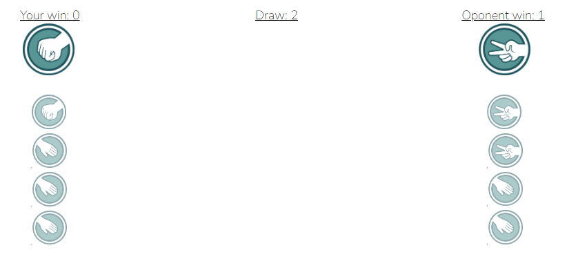
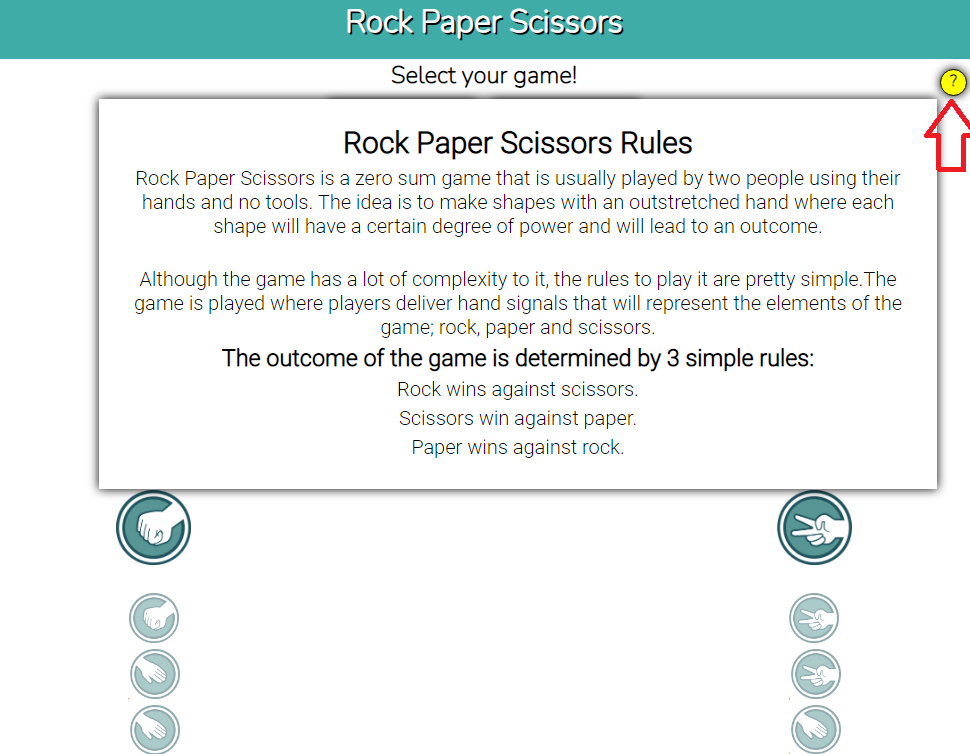

# Rock Paper Scissors

Rock Paper Scissors is a project that allows visitors to play against computer a simple yet complex game of Rock Paper Scissors. As an addition, there is an advanced version of the game available in form of Rock Paper Scissors Lizard Spock - which has been made popular by a TV Show called The Big Bang Theory.

This game will automatically decide who is the winner, log the amount of wins of each party and provide with clear and easy to read history of past 10 games. It is intended for relaxation and fun and therefore be visually pleasing and enjoyable.

## Planning

-   **Wireframes**
    - [Desktop Standard Game](./assets/readme/wireframe/standard-game-desktop.png)
    - [Desktop Advanced Game](./assets/readme/wireframe/advanced-game-desktop.png)
    - [Mobile Standard Game](./assets/readme/wireframe/standard-game-mobile.png)
    - [Mobile Advanced Game](./assets/readme/wireframe/advanced-game-mobile.png)

-   **Lucid.app**
    - [Diagram for basic functionality](./assets/readme/wireframe/luciddiagram.png)

## Features

### Existing Features

-   **The Rock Paper Scissors Logo and Heading**
    
    -   Featured at the top of the page, the Rock, paper, scissors Logo and heading are easy to see for the user. Upon viewing the page, the user will be able to see the name of the game.

    

-   **The Game selection**
    
    -   This section will allow the user to select between Standard and Advanced game. The user can clearly click a large enough buttons with the selection followed by a visual cue that the buttons were pushed.
    -   The user can also reset any current game and return to the beginning.

    

-   **Game Controls**
    -   Once an user select the game which they would like to play, an actual game controls appear, these differ by game selected
    -   Standard Rock Paper Scissors will have 3 selectors
  
    
  
    -   Advanced Rock Paper Scissors Lizard Spock will have 5 selectors
  
    

-   **Game Counter and History**
    - This section logs past played games
    - a scoreboard is displayed with the amounts of Wins, draws and losses
    - Icons of previously played games are being logged too, so user can review their past games
    - Maximum of 10 games are being logged for visual clarity
  
    

-   **Message Board**
    - Everytime a game is being played, there is a message visible to users to understand how they performed in the last game
    - Messages are pre-defined and 2 easter eggs are hidden here for user to find by playing the game
  
    

-   **Rules and Help Section**
    - If users need help understanding the rules of the selected game they can chose to see the rules directly on the page
    - clickable button will show the rules for selected game
  
    

### Future feature wishlist

-   **Best of game**
    - In next iteration, a new selection for best of 3 and best of 5 will be offered
    - only winning the 'best of 3/5' will count towards single win and so on

## Testing

### Validations

-   **HTML**
    - No errors found
    
    - [image](./assets/readme/validation/html.png)

-   **CSS**
    - No errors found 
   
    - [image](./assets/readme/validation/css.png)

-   **JavaScript**
    - no errors found using [jshint.com](https://jshint.com/)
    - There are 15 functions in this file.
    - Function with the largest signature take 4 arguments, while the median is 0.
    - Largest function has 13 statements in it, while the median is 4.
    - The most complex function has a cyclomatic complexity value of 5 while the median is 1.

### Tested devices

-   Tested on OS:
    - Win 10
    - Win 11
    - MacOS Monterey (12.4)
    - Android
    - iOS (iPhone 12)
-   Test browsers
    - Chrome
    - Safari
    - MS Edge
    - Brave

### Known bugs

- Bug when game is restarted by pressing reset button, rules no longer appear
    - Solution #1: Have the controls of the game removed as well so a new game needs to be selected again
    - Solution #2: Have the rules not being removed by pressing Reset Button

- When rules are selected on certain older tiny mobile devices, the rules go under footer
    - site only optimized for 300px wide devices, narrower needs further optimization to avoid this

- Currently played hand is also appearing as first line in history tab
    - This should not be happening and only older games should appear

## Deployment

-   The website has been deployed to GitHub Pages. Steps followed:
    - In the GitHub repository, navigate to the Settings tab
    - From the source section drop-down menu, select the Master Branch
    - Once the master branch has been selected, the page will be automatically refreshed with a detailed ribbon display to indicate the successful deployment.

The live link can be found here https://zheikon.github.io/rock-paper-game/

## References and Credits

-   Rules for Standard Game https://wrpsa.com/the-official-rules-of-rock-paper-scissors/
-   Rules for advanced game https://bigbangtheory.fandom.com/wiki/Rock,_Paper,_Scissors,_Lizard,_Spock

-   Display Properties Tutorial - https://www.youtube.com/watch?v=Qf-wVa9y9V4&t=70s&ab_channel=WebDevSimplified
-   Refactoring JavaScript - https://www.youtube.com/watch?v=J18mLs-SRpI&ab_channel=GrouponOnAir
-   Flexbox in 15 minutes - https://www.youtube.com/watch?v=fYq5PXgSsbE&ab_channel=WebDevSimplified
-   Dealing with hover on mobile - https://www.youtube.com/watch?v=uuluAyw9AI0&ab_channel=KevinPowell

### Credits
-   Massive thank you to Mr_Bim_Alumni from Code Institute for helping me understand passing values between functions!

### Media
-   Icons for Rock Paper Scissors found on Google.com that lead to https://icon-library.com/ - [Actual icons here](https://icon-library.com/icon/rock-paper-scissors-icon-5.html)